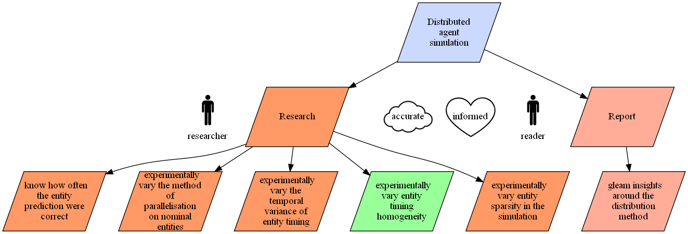
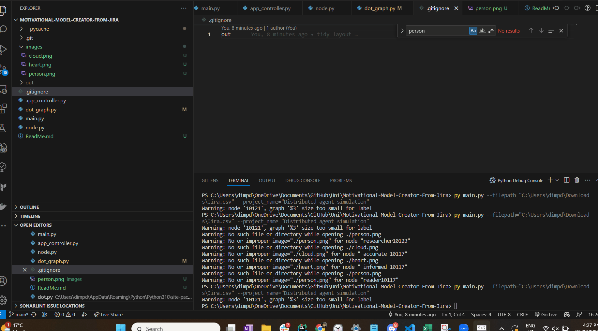

# Usage
Export issues from Jira to csv. Goto "All issues" and export in top right corner

Run the script: specify jira csv file path and the title of your project

Example usage below

`python main.py --filepath="C:\Users\dimpd\Downloads\Jira.csv" --project_name="Distributed agent simulation"`'

The motivational model diagram is by default created in the `out` folder

# Expected Jira Issue Format

* User stories for do's are written as "As a X I want to Y so that Z" 
* User stories for be's are written as "As a X I want it to be Y so that Z" 
* User stories for feel's are written as "As a X I want to feel Y so that Z" 

